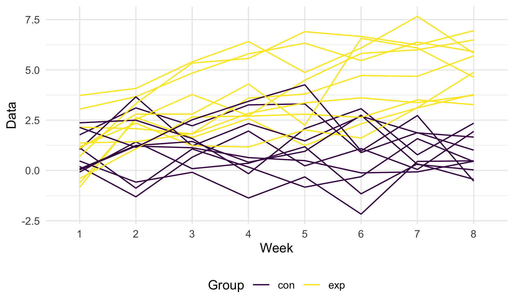

p8105\_hw5\_ly2565
================
Lin Yang
11/11/2021

## Problem 1

### Load and describe the raw dataset

``` r
homicide_raw = read_csv("data/homicide-data.csv")
```

    ## Rows: 52179 Columns: 12

    ## ── Column specification ────────────────────────────────────────────────────────
    ## Delimiter: ","
    ## chr (9): uid, victim_last, victim_first, victim_race, victim_age, victim_sex...
    ## dbl (3): reported_date, lat, lon

    ## 
    ## ℹ Use `spec()` to retrieve the full column specification for this data.
    ## ℹ Specify the column types or set `show_col_types = FALSE` to quiet this message.

This raw homicide dataset contains 52179 observations of 12 variables:
uid, reported\_date, victim\_last, victim\_first, victim\_race,
victim\_age, victim\_sex, city, state, lat, lon, disposition.

### Clean the dataset

Summarize total number of homicides and the number of unsolved homicides
within cities.

``` r
homicide_df = 
  homicide_raw %>% 
  janitor::clean_names() %>% 
  mutate(
    state = ifelse(city == "Tulsa", "OK", state),
    city_state = str_c(city, state, sep = ", "))

##total number of homicides by cities
total = homicide_df %>% 
  group_by(city_state) %>% 
  summarize(n_total = n()) 
  
##number of unsolved homicides by cities
unsolved = homicide_df %>% 
  filter(disposition != "Closed by arrest") %>% 
  group_by(city_state) %>% 
  summarize(n_unsolved = n())

homicide_prop = left_join(total, unsolved)
```

    ## Joining, by = "city_state"

``` r
homicide_prop
```

    ## # A tibble: 50 × 3
    ##    city_state      n_total n_unsolved
    ##    <chr>             <int>      <int>
    ##  1 Albuquerque, NM     378        146
    ##  2 Atlanta, GA         973        373
    ##  3 Baltimore, MD      2827       1825
    ##  4 Baton Rouge, LA     424        196
    ##  5 Birmingham, AL      800        347
    ##  6 Boston, MA          614        310
    ##  7 Buffalo, NY         521        319
    ##  8 Charlotte, NC       687        206
    ##  9 Chicago, IL        5535       4073
    ## 10 Cincinnati, OH      694        309
    ## # … with 40 more rows

### Proportion of unsolved homicides

Run `prop.test` for Baltimore, MD.

``` r
baltimore = homicide_prop %>% 
  filter(city_state == "Baltimore, MD")
baltimore_prop = 
  prop.test(pull(baltimore, n_unsolved), pull(baltimore, n_total), alternative = "two.sided", conf.level = 0.95) %>% 
  broom::tidy() %>% 
  select(estimate, conf.low, conf.high)

baltimore_prop
```

    ## # A tibble: 1 × 3
    ##   estimate conf.low conf.high
    ##      <dbl>    <dbl>     <dbl>
    ## 1    0.646    0.628     0.663

Run `prop.test` for each city.

``` r
homicide_test = 
  homicide_prop %>%
  mutate(
    prop_test = map2(.x = n_unsolved, .y = n_total, ~prop.test(x = .x, n = .y, alternative = "two.sided", conf.level = 0.95)),
    test_stats = map(prop_test, broom::tidy)) %>% 
  unnest(cols = test_stats) %>% 
  select(city_state, n_total, n_unsolved, estimate, conf.low, conf.high )

homicide_test
```

    ## # A tibble: 50 × 6
    ##    city_state      n_total n_unsolved estimate conf.low conf.high
    ##    <chr>             <int>      <int>    <dbl>    <dbl>     <dbl>
    ##  1 Albuquerque, NM     378        146    0.386    0.337     0.438
    ##  2 Atlanta, GA         973        373    0.383    0.353     0.415
    ##  3 Baltimore, MD      2827       1825    0.646    0.628     0.663
    ##  4 Baton Rouge, LA     424        196    0.462    0.414     0.511
    ##  5 Birmingham, AL      800        347    0.434    0.399     0.469
    ##  6 Boston, MA          614        310    0.505    0.465     0.545
    ##  7 Buffalo, NY         521        319    0.612    0.569     0.654
    ##  8 Charlotte, NC       687        206    0.300    0.266     0.336
    ##  9 Chicago, IL        5535       4073    0.736    0.724     0.747
    ## 10 Cincinnati, OH      694        309    0.445    0.408     0.483
    ## # … with 40 more rows

Scatterplot showing the estimates and CIs for each city.


## Problem 2

``` r
df = tibble(
  file = list.files("data/data2")) %>% 
  mutate(
    id = str_remove(file, ".csv"),
    path = str_c("data/data2/", file),
    data = map(path, read_csv)) %>% 
  unnest(data) %>% 
  select(-file, -path) %>% 
  pivot_longer(
    week_1:week_8,
    names_to = "week",
    names_prefix = "week_",
    values_to = "data"
  ) %>% 
  separate(id, into = c("group", "id"))

df %>% 
  ggplot(aes(x = week, y = data, group = interaction(group, id), color = group)) +
  geom_line() +
  labs(
    x = "Week",
    y = "Data",
    color = "Group"
  )
```


