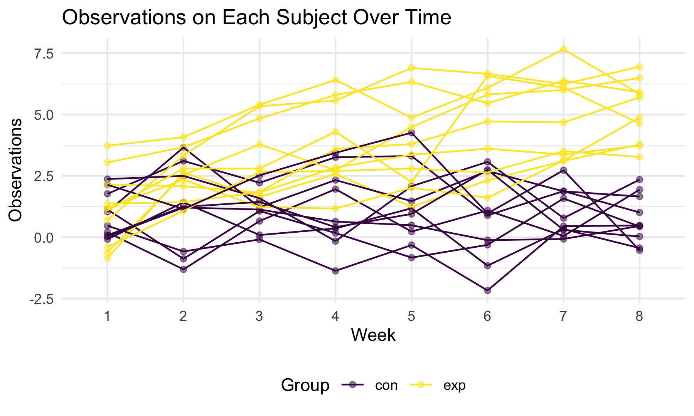

p8105\_hw5\_ly2565
================
Lin Yang
11/11/2021

## Problem 1

### Load and describe the raw dataset

``` r
homicide_raw = read_csv("data/homicide-data.csv")
```

This raw homicide dataset contains 52179 observations of 12 variables:
uid, reported\_date, victim\_last, victim\_first, victim\_race,
victim\_age, victim\_sex, city, state, lat, lon, disposition.

### Clean the dataset

Summarize total number of homicides and the number of unsolved homicides
within cities.

``` r
homicide_df = 
  homicide_raw %>% 
  janitor::clean_names() %>% 
  mutate(
    city_state = str_c(city, state, sep = ", "),
    resolution = case_when(
      disposition != "Closed by arrest" ~ "unsolved",
      disposition == "Closed by arrest" ~ "solved")) %>% 
  filter(city_state != "Tulsa, AL") %>% 
  relocate(city_state) %>% 
  group_by(city_state) %>% 
  summarize(
    unsolved = sum(resolution == "unsolved"),
    total = n())

homicide_df
```

    ## # A tibble: 50 × 3
    ##    city_state      unsolved total
    ##    <chr>              <int> <int>
    ##  1 Albuquerque, NM      146   378
    ##  2 Atlanta, GA          373   973
    ##  3 Baltimore, MD       1825  2827
    ##  4 Baton Rouge, LA      196   424
    ##  5 Birmingham, AL       347   800
    ##  6 Boston, MA           310   614
    ##  7 Buffalo, NY          319   521
    ##  8 Charlotte, NC        206   687
    ##  9 Chicago, IL         4073  5535
    ## 10 Cincinnati, OH       309   694
    ## # … with 40 more rows

### Proportion of unsolved homicides

Run `prop.test` for Baltimore, MD.

``` r
baltimore_summary = 
  homicide_df %>% 
  filter(city_state == "Baltimore, MD")

baltimore_test =
  prop.test(
    pull(baltimore_summary, unsolved), 
    pull(baltimore_summary, total)) %>% 
  broom::tidy() %>% 
  select(estimate, starts_with("conf"))

baltimore_test
```

    ## # A tibble: 1 × 3
    ##   estimate conf.low conf.high
    ##      <dbl>    <dbl>     <dbl>
    ## 1    0.646    0.628     0.663

Run `prop.test` for each city.

``` r
homicide_test =
  homicide_df %>%
  mutate(
    test_results = map2(unsolved, total, prop.test),
    tidy_results = map(test_results, broom::tidy)) %>% 
  select(city_state, tidy_results) %>% 
  unnest(tidy_results) %>% 
  select(city_state, estimate, starts_with("conf"))

homicide_test
```

    ## # A tibble: 50 × 4
    ##    city_state      estimate conf.low conf.high
    ##    <chr>              <dbl>    <dbl>     <dbl>
    ##  1 Albuquerque, NM    0.386    0.337     0.438
    ##  2 Atlanta, GA        0.383    0.353     0.415
    ##  3 Baltimore, MD      0.646    0.628     0.663
    ##  4 Baton Rouge, LA    0.462    0.414     0.511
    ##  5 Birmingham, AL     0.434    0.399     0.469
    ##  6 Boston, MA         0.505    0.465     0.545
    ##  7 Buffalo, NY        0.612    0.569     0.654
    ##  8 Charlotte, NC      0.300    0.266     0.336
    ##  9 Chicago, IL        0.736    0.724     0.747
    ## 10 Cincinnati, OH     0.445    0.408     0.483
    ## # … with 40 more rows

Scatterplot showing the estimates and CIs for each city.


## Problem 2

Create a tidy dataframe containing data from all participants.

``` r
df = tibble(
  file = list.files("data/data2")) %>% 
  mutate(
    id = str_remove(file, ".csv"),
    path = str_c("data/data2/", file),
    data = map(path, read_csv)) %>% 
  unnest(data) %>% 
  select(-file, -path) %>% 
  pivot_longer(
    week_1:week_8,
    names_to = "week",
    names_prefix = "week_",
    values_to = "observation"
  ) %>% 
  separate(id, into = c("group", "id"))

df
```

    ## # A tibble: 160 × 4
    ##    group id    week  observation
    ##    <chr> <chr> <chr>       <dbl>
    ##  1 con   01    1            0.2 
    ##  2 con   01    2           -1.31
    ##  3 con   01    3            0.66
    ##  4 con   01    4            1.96
    ##  5 con   01    5            0.23
    ##  6 con   01    6            1.09
    ##  7 con   01    7            0.05
    ##  8 con   01    8            1.94
    ##  9 con   02    1            1.13
    ## 10 con   02    2           -0.88
    ## # … with 150 more rows

Make a spaghetti plot showing observations on each subject over time.

``` r
df %>% 
  ggplot(aes(x = week, y = observation, group = interaction(group, id), color = group)) +
  geom_line() +
  labs(
    x = "Week",
    y = "Observations",
    title = "Observations on Each Subject Over Time",
    color = "Group"
  )
```


Based on the plot, observations on participants from the experimental
arm are, in general, higher than the control arm.

## Problem 3

Load the iris dataset and introduce some missing values.

``` r
library(tidyverse)

set.seed(10)

iris_with_missing = iris %>% 
  map_df(~replace(.x, sample(1:150, 20), NA)) %>%
  mutate(Species = as.character(Species))
```

Write a function that replaces missing values.

``` r
fill_na = function(x) {
  if (is.numeric(x)) {
    x = replace_na(x, mean(x, na.rm = TRUE))
  }
  if (is.character(x)) {
    x = replace_na(x, "Virginica")
  }
  
  x
}
```

Apply this function to the dataframe `iris_with_missing` to get a
dataframe without missing values.

``` r
iris_no_missing = map_df(iris_with_missing, fill_na)
iris_no_missing
```

    ## # A tibble: 150 × 5
    ##    Sepal.Length Sepal.Width Petal.Length Petal.Width Species
    ##           <dbl>       <dbl>        <dbl>       <dbl> <chr>  
    ##  1         5.1          3.5         1.4         0.2  setosa 
    ##  2         4.9          3           1.4         0.2  setosa 
    ##  3         4.7          3.2         1.3         0.2  setosa 
    ##  4         4.6          3.1         1.5         1.19 setosa 
    ##  5         5            3.6         1.4         0.2  setosa 
    ##  6         5.4          3.9         1.7         0.4  setosa 
    ##  7         5.82         3.4         1.4         0.3  setosa 
    ##  8         5            3.4         1.5         0.2  setosa 
    ##  9         4.4          2.9         1.4         0.2  setosa 
    ## 10         4.9          3.1         3.77        0.1  setosa 
    ## # … with 140 more rows
